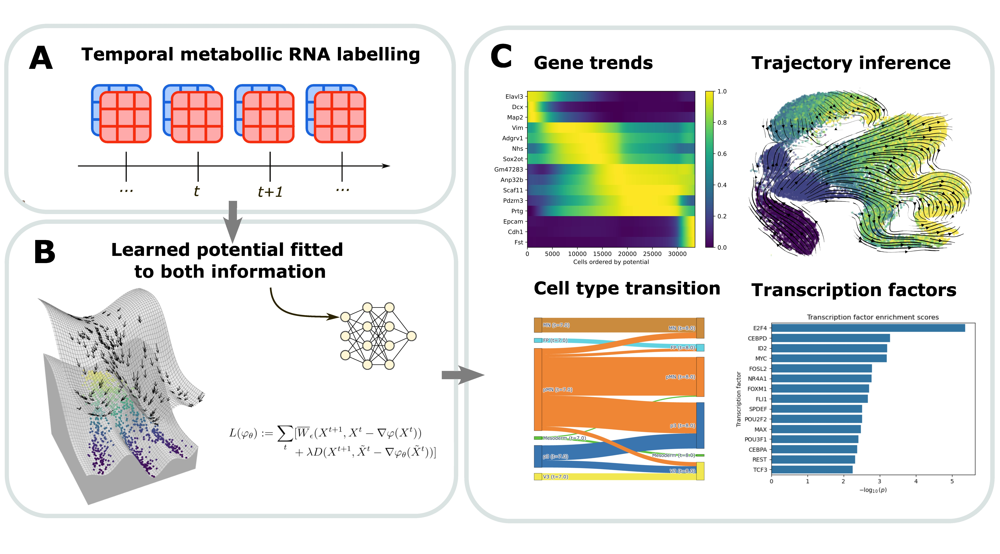

# FLOWSTATE : Inferring Cell Fate Trajectories in Time-Resolved Metabolic RNA Labeling data

FLOWSTATE is a trajectory inference method that leverages the information provided by metabollically labelled RNA. FLOWSTATE modeling cellular differentiation as the minimization of a potential function. Understanding this potential can elucidate the genes and transcription factors driving cellular evolution, reveal diverse potential trajectories, and forecast a cell’s future evolution based on its initial state

FlOWSTATE is built on the Scverse ecosystem, allowing seamless integration with pre-existing single-cell analysis tools such as Scanpy. It uses the JAX ecosystem for deep learning and efficient optimal transport computations. 
This folder contains the code used to train, evaluate, and analyze dynamical models of cell-state progression. The project combines velocity and potential-based modeling, optimal transport, and downstream biological interpretation.

## Getting started
FlOWSTATE takes as an input an AnnData object, where omics information and labeled RNA information are stored in `obsm`, and `obs` contains time information, 

The code to reproduce the figure of the paper can be found here https://github.com/cantinilab/FLOWSTATE_reproducibility